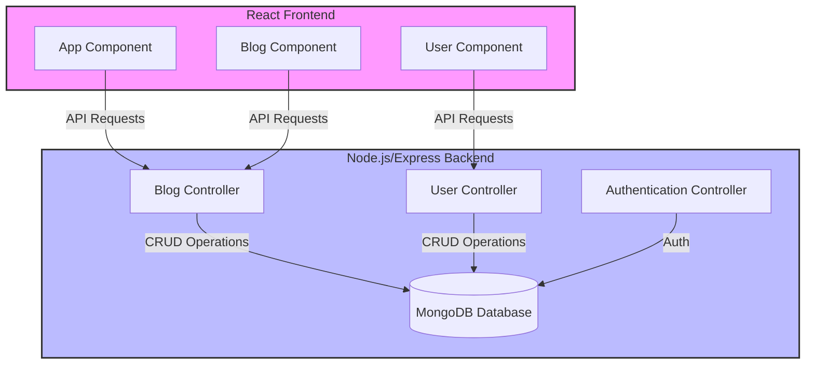

# A Simple and Comprehensive Blog App

## Description
This Blog App is my implementation of a full-stack web application during the [Full Stack Open course](https://fullstackopen.com/en/). It allows users to create, read, comment, and delete blog posts. Built with React, Node.js, Express, and MongoDB, it comes with modern web development practices including RESTful API design, state management, and responsive UI.

## Technologies Used
- **Frontend**: React
- **Backend**: Node.js, Express
- **Database**: MongoDB
- **Testing**: Jest, Cypress
- **Linting**: ESLint, Prettier
- **CI/CD**: GitHub Actions
- **Deployment**: Fly.io

## Features
- User authentication and authorization
- Create, read, comment, and delete blog posts
- Responsive design

## App Architecture
